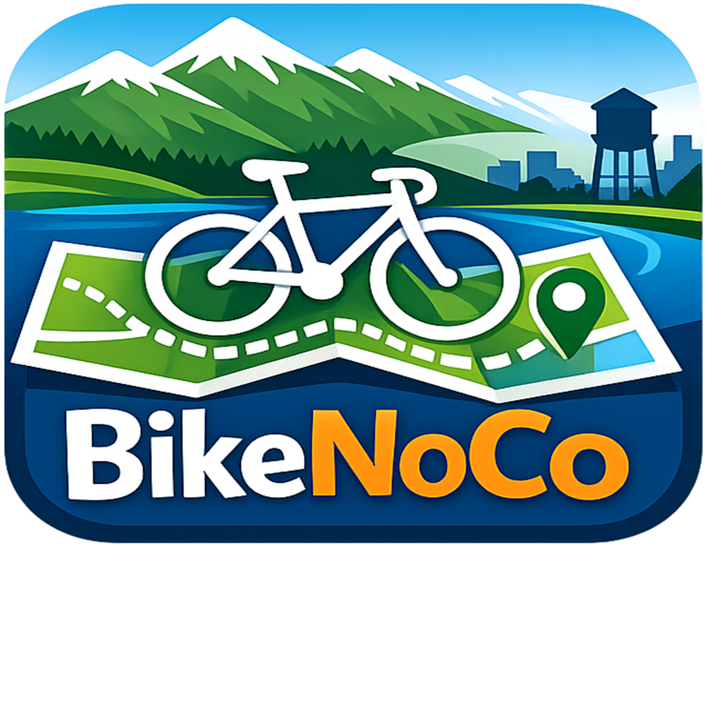

# BikeNoCo



A cycling map for Fort Collins and Loveland, Colorado. Built with SwiftUI and MapKit.

## Features

- **Full infrastructure map** — every bike lane, buffered lane, separated lane, sharrow, sidepath, and multiuse trail, color-coded by facility type
- **Level of Traffic Stress (LTS)** — tap any route segment to see its stress rating and speed limit
- **Suggested rides** — four curated road rides from [BikeForFortCollins.org](https://bikefortcollins.org), with distance, elevation, and route description. Select one to preview it on the map
- **Ride recorder** — GPS tracking with elapsed time, distance, and live speed; continues recording in the background
- **Map styles** — satellite, hybrid, standard, and muted

## Screenshots

| Map | Filter & Rides | Ride Selected | Active Route |
|-----|---------------|---------------|--------------|
|  |  |  |  |

## Requirements

- iOS 17.0+
- Xcode 15+
- [XcodeGen](https://github.com/yonaskolb/XcodeGen)

## Getting Started

```bash
git clone https://github.com/dlarmitage/BikeNoCO.git
cd BikeNoCO
xcodegen generate
open BikeNoCo.xcodeproj
```

## Data Sources

- **Fort Collins bike facilities** — [City of Fort Collins ArcGIS REST API](https://services1.arcgis.com/dLpFH5mwVvxSN4OE/arcgis/rest/services)
- **Loveland bikeways** — [City of Loveland ArcGIS REST API](https://pwmaps.cityofloveland.org/arcgis/rest/services)
- **Suggested rides** — [RideWithGPS](https://ridewithgps.com) public route API, curated by [BikeForFortCollins.org](https://bikefortcollins.org)

## Tech Stack

- SwiftUI
- MapKit / MKMultiPolyline
- CoreLocation
- ArcGIS REST + RideWithGPS public APIs
- XcodeGen

## License

MIT
